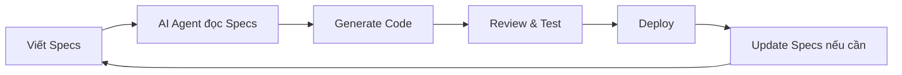

# 🚀 Microblog CMS

> **A modern full-stack blog CMS built with Next.js, TypeScript, Supabase, and TailwindCSS**  
> Developed using **Agentic Coding** and **Spec-Driven Development** with [Speckit](https://github.com/speckai/speckit)

[](https://nextjs.org/)
[](https://www.typescriptlang.org/)
[](https://supabase.com/)
[](https://tailwindcss.com/)
[](https://opensource.org/licenses/MIT)

## 📖 Giới thiệu

**Microblog CMS** là một hệ thống quản lý nội dung blog hiện đại, được phát triển hoàn toàn bằng **Agentic Coding** - một phương pháp phát triển phần mềm sử dụng AI agents để tự động hóa quá trình coding dựa trên specifications chi tiết.

### 🤖 Agentic Coding & Spec-Driven Development

Repository này là một case study thực tế về việc áp dụng **Spec-Driven Development (SDD)** kết hợp với **AI-powered code generation**:

#### 📋 Speckit Framework
Dự án sử dụng [**Speckit**](https://github.com/speckai/speckit) - một framework để viết specifications theo format chuẩn, sau đó generate code tự động thông qua AI agents (GitHub Copilot, Cursor, v.v.)

#### 🎯 Quy trình phát triển



1. **Viết Specifications** → Tài liệu chi tiết trong `specs/` folder
2. **AI Agent đọc Specs** → GitHub Copilot/Cursor phân tích requirements
3. **Generate Code** → AI tự động tạo components, APIs, database schema
4. **Review & Test** → Developer review và test code được generate
5. **Iterate** → Update specs và repeat process

#### ✨ Lợi ích của phương pháp này

- ⚡ **Tăng tốc 5-10x**: Code được generate tự động từ specs
- 📚 **Documentation đầy đủ**: Specs là living documentation
- 🎯 **Consistency**: Code follow patterns từ specs
- 🔄 **Maintainable**: Dễ update khi có thay đổi requirements
- 🧪 **Testable**: Test cases derive trực tiếp từ acceptance scenarios

---

## 🎨 Demo & Screenshots

> **Note**: Screenshots đang được cập nhật. Xem folder [`docs/screenshots/`](./docs/screenshots/) để theo dõi tiến độ.

### Public Frontend
- **Homepage**: Timeline hiển thị bài viết với tags và excerpt
- **Post Detail**: Render Markdown với syntax highlighting
- **Tag Pages**: Filter bài viết theo tags
- **Comments**: Hệ thống bình luận với moderation

### Admin Panel
- **Dashboard**: Thống kê posts, comments, views
- **Posts Management**: CRUD với Markdown editor
- **Comments Moderation**: Approve/Reject/Delete với bulk actions
- **Tags Management**: Rename và delete tags
- **User Management**: Thay đổi roles (Super Admin only)

---

## ✨ Tính năng chính

### 📝 Quản lý Nội dung
- **Markdown Editor**: Soạn thảo bài viết với Markdown, preview realtime
- **Tags System**: Phân loại bài viết với tags, auto-generate tag pages
- **Draft Mode**: Lưu bản nháp, schedule publish
- **Image Upload**: Upload và quản lý hình ảnh
- **Post Revisions**: Lưu lịch sử chỉnh sửa

### 💬 Hệ thống Bình luận
- **Moderation**: Duyệt bình luận (approve/reject/delete)
- **Spam Protection**: Rate limiting, honeypot field
- **Bulk Actions**: Thao tác hàng loạt
- **IP Tracking**: Log IP address (hashed) để chống spam

### 👥 Quản lý Người dùng
- **4 Roles**: Super Admin, Admin, Author, Reader
- **Permission Control**: Row Level Security với Supabase
- **Role Management**: Thay đổi roles, log changes
- **Authentication**: Email/password với JWT tokens

### 📊 Dashboard & Analytics
- **Stats Overview**: Posts, comments, views, tags count
- **Charts**: Views theo thời gian (7/30/90 days)
- **Top Posts**: Bài viết xem nhiều nhất
- **Recent Activity**: Bình luận mới nhất

### 🎨 Giao diện Public
- **Responsive Design**: Mobile-first, works trên mọi devices
- **Fast Loading**: Static generation với Next.js SSG
- **SEO Optimized**: Meta tags, Open Graph, structured data
- **Syntax Highlighting**: Code blocks với syntax highlighting
- **Tag Filtering**: Lọc bài viết theo tags

### 🔐 Bảo mật
- **Row Level Security**: Policies trên Supabase
- **JWT Authentication**: Secure token-based auth
- **Audit Logs**: Track mọi thay đổi quan trọng
- **IP Rate Limiting**: Chống spam và abuse

---

## 🚀 Quick Start

### Prerequisites

- **Node.js** 18+ installed
- **npm** or **yarn** package manager
- **Supabase account** (free tier works great)

### Installation

#### 1. Clone repository
```bash
git clone https://github.com/your-username/microblog-cms.git
cd microblog-cms
```

#### 2. Install dependencies
```bash
npm install
```

#### 3. Setup Environment Variables

Create `.env.local` file:

```env
# Supabase Configuration
NEXT_PUBLIC_SUPABASE_URL=your_supabase_project_url
NEXT_PUBLIC_SUPABASE_ANON_KEY=your_supabase_anon_key
SUPABASE_SERVICE_ROLE_KEY=your_supabase_service_role_key
```

> **Lấy thông tin từ đâu?**  
> Vào [Supabase Dashboard](https://app.supabase.com/) → Project Settings → API

#### 4. Setup Database

Run các SQL migrations trong Supabase SQL Editor:

```bash
# Vào Supabase Dashboard → SQL Editor
# Chạy các file trong thư mục supabase/migrations/ theo thứ tự:
# 1. 000_create_user_profiles.sql
# 2. 001_create_posts.sql
# 3. 002_create_tags.sql
# ... (xem folder migrations để biết thứ tự đầy đủ)
```

Hoặc sử dụng Supabase CLI:
```bash
# Install Supabase CLI
npm install -g supabase

# Link to your project
supabase link --project-ref your-project-ref

# Run migrations
supabase db push
```

#### 5. Create Super Admin User

Đăng ký user đầu tiên qua Supabase Auth, sau đó chạy SQL:

```sql
UPDATE user_profiles 
SET role = 'super_admin' 
WHERE email = 'your-email@example.com';
```

#### 6. Run Development Server

```bash
npm run dev
```

Mở [http://localhost:3000](http://localhost:3000) 🎉

- **Public site**: http://localhost:3000
- **Admin panel**: http://localhost:3000/admin/login

---

## 📂 Cấu trúc Project

```
microblog-cms/
├── 📁 .github/
│   └── prompts/                    # AI prompts cho Speckit
│       ├── speckit.implement.prompt.md
│       └── speckit.refine.prompt.md
│
├── 📁 docs/                        # 📚 DOCUMENTATION
│   ├── README.md                   # Overview tài liệu
│   ├── TAI_LIEU_SAN_PHAM.md       # Tài liệu sản phẩm đầy đủ (30+ pages)
│   ├── HUONG_DAN_CHUP_SCREENSHOT.md
│   ├── SCREENSHOT_CHECKLIST.md
│   ├── QUICK_REFERENCE.md         # Tóm tắt 1 trang
│   └── screenshots/               # Screenshots (49 items planned)
│
├── 📁 specs/                       # 📋 SPECIFICATIONS (SDD)
│   ├── README.md                   # Overview specs
│   ├── microblog-cms/
│   │   ├── spec.md                # Feature specifications
│   │   ├── requirements.md        # Chi tiết requirements
│   │   └── checklists/
│   │       └── development.md     # Development checklist
│   └── phase-2/                   # Phase 2 implementation
│       ├── tasks.md               # Task breakdown
│       ├── plan.md                # Development plan
│       └── README.md
│
├── 📁 supabase/
│   └── migrations/                # SQL migrations (ordered)
│       ├── 000_create_user_profiles.sql
│       ├── 001_create_posts.sql
│       ├── 002_create_tags.sql
│       └── ... (10+ migration files)
│
├── 📁 src/
│   ├── 📁 components/
│   │   ├── admin/                 # Admin panel components
│   │   │   ├── AdminLayout.tsx
│   │   │   ├── PostForm.tsx
│   │   │   └── ...
│   │   └── blog/                  # Public blog components
│   │       ├── PostCard.tsx
│   │       ├── CommentForm.tsx
│   │       └── ...
│   │
│   ├── 📁 contexts/
│   │   └── AuthContext.tsx        # Authentication context
│   │
│   ├── 📁 lib/
│   │   ├── supabase/
│   │   │   ├── client.ts          # Client-side Supabase
│   │   │   └── server.ts          # Server-side Supabase
│   │   └── utils.ts               # Utility functions
│   │
│   ├── 📁 pages/
│   │   ├── admin/                 # 🔐 Admin Panel
│   │   │   ├── login.tsx
│   │   │   ├── dashboard.tsx
│   │   │   ├── posts/
│   │   │   ├── comments.tsx
│   │   │   ├── tags.tsx
│   │   │   └── users.tsx
│   │   │
│   │   ├── api/                   # 🔌 API Routes
│   │   │   ├── auth/
│   │   │   └── admin/
│   │   │       ├── posts/
│   │   │       ├── comments/
│   │   │       ├── tags/
│   │   │       └── users/
│   │   │
│   │   ├── posts/                 # 📰 Public Post Pages
│   │   │   └── [slug].tsx
│   │   │
│   │   ├── tags/                  # 🏷️ Tag Pages
│   │   │   ├── index.tsx
│   │   │   └── [slug].tsx
│   │   │
│   │   ├── index.tsx              # 🏠 Homepage
│   │   ├── _app.tsx
│   │   └── _document.tsx
│   │
│   └── 📁 styles/
│       └── globals.css
│
├── 📁 scripts/                    # Utility scripts
│   ├── test-connection.ts
│   └── ...
│
├── 📄 next.config.js
├── 📄 tailwind.config.js
├── 📄 tsconfig.json
├── 📄 package.json
└── 📄 README.md                   # 👈 BẠN ĐANG Ở ĐÂY
```

### 🗂️ Thư mục quan trọng

#### `/specs` - Specifications (❤️ Core của SDD)
Chứa tất cả specifications được viết theo Speckit format:
- **User stories** với acceptance scenarios
- **Requirements** (Functional & Non-functional)
- **Task breakdown** chi tiết
- **Development checklists**

👉 **AI agents đọc folder này để generate code**

#### `/docs` - Documentation
Tài liệu đầy đủ bằng tiếng Việt:
- Product documentation (30+ trang)
- Screenshot guides
- Quick reference

#### `/src/pages/admin` - Admin Panel
Giao diện quản trị cho Super Admin, Admin, Author

#### `/src/pages/api/admin` - Admin APIs
RESTful APIs cho admin panel (protected routes)

---

## 🛠️ Technology Stack

### Frontend
- **[Next.js 14.2.33](https://nextjs.org/)** - React framework với Pages Router, SSG
- **[React 18](https://react.dev/)** - UI library
- **[TypeScript 5.6.3](https://www.typescriptlang.org/)** - Type safety
- **[TailwindCSS 3.4.1](https://tailwindcss.com/)** - Utility-first CSS
- **[Headless UI](https://headlessui.com/)** - Accessible UI components

### Backend & Database
- **[Supabase](https://supabase.com/)** - PostgreSQL database + Auth + Storage
  - Row Level Security (RLS) policies
  - JWT authentication
  - Real-time subscriptions (optional)
- **[Supabase Auth](https://supabase.com/auth)** - Email/password authentication

### Development Tools
- **[Speckit](https://github.com/speckai/speckit)** - Spec-Driven Development framework
- **GitHub Copilot** / **Cursor** - AI coding assistants
- **ESLint** - Code linting
- **Prettier** - Code formatting (optional)

### Deployment
- **[Vercel](https://vercel.com/)** - Hosting (recommended)
- **Supabase Cloud** - Database hosting

---

## 📖 Hướng dẫn Sử dụng

### Cho Developer mới

#### 1. Đọc Specifications trước
```bash
# Bắt đầu với README
cat specs/README.md

# Đọc feature specifications
cat specs/microblog-cms/spec.md

# Xem requirements chi tiết
cat specs/microblog-cms/requirements.md

# Check development tasks
cat specs/phase-2/tasks.md
```

#### 2. Hiểu cấu trúc Database
```bash
# Xem database schema trong migrations
ls -la supabase/migrations/

# Đọc migration files để hiểu tables
cat supabase/migrations/000_create_user_profiles.sql
cat supabase/migrations/001_create_posts.sql
```

#### 3. Khám phá Code
```bash
# Bắt đầu với AuthContext
cat src/contexts/AuthContext.tsx

# Xem admin layout
cat src/components/admin/AdminLayout.tsx

# Xem API routes
ls -la src/pages/api/admin/
```

### Cho Content Creator

#### Tạo bài viết mới
1. Login vào admin panel: http://localhost:3000/admin/login
2. Vào "Posts" → Click "New Post"
3. Điền thông tin:
   - **Title**: Tiêu đề bài viết
   - **Content**: Viết nội dung bằng Markdown
   - **Tags**: Chọn hoặc tạo tags mới
   - **Status**: Draft hoặc Published
4. Click "Save" hoặc "Publish"

#### Kiểm duyệt bình luận
1. Vào "Comments"
2. Tab "Pending" để xem comments chờ duyệt
3. Click "Approve" để duyệt hoặc "Reject" để từ chối

### Cho Admin

#### Thay đổi role user (Super Admin only)
1. Vào "Users"
2. Tìm user cần thay đổi
3. Click dropdown ở cột "Role"
4. Chọn role mới → Confirm

#### Quản lý tags (Super Admin only)
1. Vào "Tags"
2. Rename: Click "Rename" → Nhập tên mới → Save
3. Delete: Click "Delete" (chỉ khi tag không được dùng)

---

## 🤖 Agentic Coding với Speckit

### Cách Project này được Develop

#### Phase 1: Viết Specifications
```bash
# File specs/microblog-cms/spec.md
- User stories (5 stories)
- Acceptance scenarios (Given-When-Then)
- Edge cases
- Requirements (FR-001 to FR-020)
```

#### Phase 2: AI Agent Generate Code
```bash
# AI Agent đọc specs và generate:
1. Database schema → supabase/migrations/
2. React components → src/components/
3. API routes → src/pages/api/
4. Pages → src/pages/
```

#### Phase 3: Review & Iterate
```bash
# Developer:
1. Review generated code
2. Test functionality
3. Fix bugs nếu có
4. Update specs nếu requirements thay đổi
5. AI re-generate với specs mới
```

### Tái sử dụng cho Project mới

#### Bước 1: Copy Specs Template
```bash
# Copy folder specs/ và modify cho project của bạn
cp -r specs/ ../your-new-project/specs/
```

#### Bước 2: Modify Specifications
```bash
# Edit specs/your-project/spec.md
# Thay đổi:
# - User stories
# - Requirements
# - Database schema
# - UI mockups
```

#### Bước 3: Generate Code với AI
```bash
# Trong editor (Cursor/VS Code với Copilot):
# 1. Open specs file
# 2. Highlight user story
# 3. Ask AI: "Generate code for this user story"
# 4. Review và accept/reject suggestions
```

#### Bước 4: Follow Checklist
```bash
# Dùng development checklist
cat specs/microblog-cms/checklists/development.md

# Check off từng item khi complete
```

### Prompts hữu ích

```bash
# Trong .github/prompts/
cat .github/prompts/speckit.implement.prompt.md
cat .github/prompts/speckit.refine.prompt.md
```

**Prompt templates** để guide AI agent:
- `speckit.implement.prompt.md` - Generate implementation code
- `speckit.refine.prompt.md` - Refine existing code

---

## 🧪 Testing

### Run Tests
```bash
# Run all tests
npm test

# Run specific test
npm test -- posts.test.ts

# Run with coverage
npm test -- --coverage
```

### Manual Testing Checklist

#### Public Frontend
- [ ] Homepage hiển thị posts
- [ ] Click vào post → Xem chi tiết
- [ ] Click vào tag → Filter posts
- [ ] Submit comment → Pending state
- [ ] Responsive trên mobile

#### Admin Panel
- [ ] Login với email/password
- [ ] Dashboard hiển thị stats
- [ ] Tạo post mới → Save draft
- [ ] Publish post → Hiển thị trên public
- [ ] Approve comment → Show trên post
- [ ] Thay đổi role user (Super Admin)

### Database Testing Scripts

```bash
# Test connection
npx ts-node scripts/test-connection.ts

# Test user role function
npx ts-node scripts/test-get-user-role.ts

# Test admin access
npx ts-node scripts/test-admin-access.ts
```

---

## 📊 Performance

### Metrics mục tiêu
- ⚡ **First Contentful Paint**: < 1.5s
- 📊 **Lighthouse Performance**: ≥ 90
- 🎯 **SEO Score**: ≥ 90
- ♿ **Accessibility**: ≥ 90
- 📦 **Bundle Size**: < 200KB (gzipped)

### Optimization techniques đã áp dụng
- ✅ Static Site Generation (SSG)
- ✅ Image optimization với Next.js Image
- ✅ Code splitting tự động
- ✅ Lazy loading components
- ✅ Database indexing
- ✅ API response caching

---

## 🔐 Security

### Implemented
- ✅ **Row Level Security (RLS)** trên Supabase
- ✅ **JWT Authentication** với secure cookies
- ✅ **Rate Limiting** cho comments
- ✅ **Input Sanitization** cho Markdown
- ✅ **IP Tracking** (hashed) cho spam protection
- ✅ **Audit Logs** cho critical changes

### Environment Variables Security
```bash
# KHÔNG commit .env.local vào Git
echo ".env.local" >> .gitignore

# Dùng secrets management trong production
# Vercel: Settings → Environment Variables
# Netlify: Site settings → Environment variables
```

---

## 🤝 Contributing

### Quy trình Contribute

#### 1. Fork và Clone
```bash
git clone https://github.com/your-username/microblog-cms.git
cd microblog-cms
git remote add upstream https://github.com/original/microblog-cms.git
```

#### 2. Tạo Branch mới
```bash
# Format: feature/feature-name hoặc fix/bug-name
git checkout -b feature/add-newsletter
```

#### 3. Develop theo Specs
```bash
# QUAN TRỌNG: Đọc specs trước khi code
cat specs/your-feature/spec.md

# Write code following specs
# Run tests
npm test

# Commit với clear message
git commit -m "feat: add newsletter subscription feature"
```

#### 4. Push và Create PR
```bash
git push origin feature/add-newsletter

# Vào GitHub → Create Pull Request
# Title: Clear description
# Description: 
# - What changes
# - Why needed
# - Link to specs
```

#### 5. Code Review
- Maintainer sẽ review PR
- Update theo feedback nếu có
- Merge khi approved

### Coding Standards

#### TypeScript
```typescript
// ✅ Good: Type everything
interface Post {
  id: string;
  title: string;
  content: string;
}

// ❌ Bad: No any types
const data: any = getData();
```

#### Components
```typescript
// ✅ Good: Functional components với TypeScript
export const PostCard: React.FC<{ post: Post }> = ({ post }) => {
  return <div>{post.title}</div>;
};

// ❌ Bad: Class components
class PostCard extends React.Component { ... }
```

#### Naming
```typescript
// ✅ Good
- Components: PascalCase (PostCard, AdminLayout)
- Functions: camelCase (getUserRole, fetchPosts)
- Constants: UPPER_SNAKE_CASE (API_URL, MAX_POSTS)
- Files: kebab-case (admin-layout.tsx, user-management.tsx)
```

---

## 🐛 Troubleshooting

### Common Issues

#### 1. "Failed to fetch users"
**Nguyên nhân**: RLS chưa được setup hoặc service role key sai  
**Giải pháp**:
```bash
# Check env vars
cat .env.local | grep SUPABASE

# Verify service role key trong Supabase Dashboard
# Run RLS migrations
```

#### 2. "Unauthorized" khi truy cập admin
**Nguyên nhân**: Chưa đăng nhập hoặc role không đủ  
**Giải pháp**:
```sql
-- Check user role trong database
SELECT email, role FROM user_profiles 
WHERE email = 'your-email@example.com';

-- Update role nếu cần
UPDATE user_profiles SET role = 'super_admin' 
WHERE email = 'your-email@example.com';
```

#### 3. Build errors
**Nguyên nhân**: TypeScript errors hoặc missing dependencies  
**Giải pháp**:
```bash
# Reinstall dependencies
rm -rf node_modules package-lock.json
npm install

# Check TypeScript errors
npx tsc --noEmit

# Fix import paths
```

#### 4. Database connection failed
**Nguyên nhân**: Sai Supabase credentials  
**Giải pháp**:
```bash
# Test connection
npx ts-node scripts/test-connection.ts

# Verify credentials trong .env.local
# Copy lại từ Supabase Dashboard → Settings → API
```

---

## 🗺️ Roadmap

### ✅ Phase 1: MVP (Completed)
- [x] Static blog với Markdown
- [x] Homepage timeline
- [x] Post detail pages
- [x] Tag filtering
- [x] SEO optimization

### ✅ Phase 2: CMS (Completed)
- [x] Admin panel
- [x] User authentication
- [x] Post management (CRUD)
- [x] Comment moderation
- [x] Tag management
- [x] User management
- [x] Dashboard & stats

### 🚧 Phase 3: Enhanced Features (Planned)
- [ ] Email notifications (new comments)
- [ ] RSS feed generation
- [ ] Full-text search (Algolia/Meilisearch)
- [ ] Categories (ngoài tags)
- [ ] Multi-language support (i18n)
- [ ] Dark mode toggle
- [ ] Newsletter subscription

### 🔮 Phase 4: Advanced (Future)
- [ ] PWA support (offline reading)
- [ ] Comment replies (nested)
- [ ] Like/reaction system
- [ ] Reading time estimate
- [ ] AI-powered related posts
- [ ] Social media auto-posting
- [ ] Custom themes
- [ ] Plugin system

---

## 📄 License

MIT License - xem file [LICENSE](./LICENSE) để biết chi tiết.

```
Copyright (c) 2025 Microblog CMS Contributors

Permission is hereby granted, free of charge, to any person obtaining a copy
of this software and associated documentation files (the "Software"), to deal
in the Software without restriction...
```

---

## 🙏 Acknowledgments

### Tools & Technologies
- [Next.js](https://nextjs.org/) - The React Framework
- [Supabase](https://supabase.com/) - Open source Firebase alternative
- [Vercel](https://vercel.com/) - Deployment platform
- [TailwindCSS](https://tailwindcss.com/) - Utility-first CSS

### Inspiration
- [Speckit](https://github.com/speckai/speckit) - Spec-Driven Development framework
- [Cursor](https://cursor.sh/) - AI-first code editor
- [GitHub Copilot](https://github.com/features/copilot) - AI pair programmer

### Community
Special thanks to the open-source community và tất cả contributors!

---

## 📞 Support & Contact

### Documentation
- **Full docs**: [`docs/TAI_LIEU_SAN_PHAM.md`](./docs/TAI_LIEU_SAN_PHAM.md)
- **Quick reference**: [`docs/QUICK_REFERENCE.md`](./docs/QUICK_REFERENCE.md)
- **Specs**: [`specs/`](./specs/)

### Issues & Bugs
- **GitHub Issues**: [Create new issue](https://github.com/your-repo/issues/new)
- **Bug report template**: Describe issue, steps to reproduce, expected vs actual behavior

### Questions
- **GitHub Discussions**: [Start a discussion](https://github.com/your-repo/discussions)
- **Email**: your-email@example.com

### Contributing
- **Contribution guide**: See [Contributing](#-contributing) section above
- **Code of Conduct**: Be respectful và professional

---

## 🎓 Learning Resources

### Spec-Driven Development
- [Speckit Documentation](https://github.com/speckai/speckit)
- [Writing Good Specifications](https://example.com/writing-specs)
- [Agentic Coding Best Practices](https://example.com/agentic-coding)

### Next.js & React
- [Next.js Learn Course](https://nextjs.org/learn)
- [React Documentation](https://react.dev/learn)
- [TypeScript Handbook](https://www.typescriptlang.org/docs/handbook/)

### Supabase
- [Supabase Quickstart](https://supabase.com/docs/guides/getting-started)
- [Row Level Security Guide](https://supabase.com/docs/guides/auth/row-level-security)
- [Supabase Auth Guide](https://supabase.com/docs/guides/auth)

---

<div align="center">

## ⭐ Star this repo if you find it useful!

**Built with ❤️ using Agentic Coding & Spec-Driven Development**

[⬆ Back to top](#-microblog-cms)

</div>
